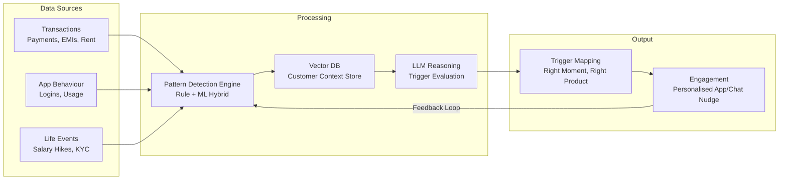

# 🔍 Nirikshak.AI — Proactive Intelligence for Life-Stage Banking

> **SBI Hackathon — PS-3**
> A RAG + LLM engine that senses financial patterns and life events, then proactively delivers personalised, explainable product nudges to customers.

---

## 📋 Problem Statement

Customer engagement at banks is overwhelmingly **reactive**. Customers must seek out products themselves; salary hikes, new EMIs, and dormant accounts carry strong signals that are never acted upon. Insurance, investments, and mobile banking remain under-adopted despite highly relevant customer moments.

**Nirikshak.AI** changes this by:
1. Detecting behavioural, financial, and life-event signals in real time
2. Reasoning proactively over customer context using RAG + LLM
3. Triggering the right product nudge at the right life moment
4. Explaining every trigger transparently to build customer trust
5. Continuously improving accuracy via a feedback loop

---

## 💡 Proposed Solution

A three-step intelligent pipeline:

| Step | What It Does |
|------|-------------|
| **Sense** | Detect behaviour, spend & life-event patterns from transaction data |
| **Reason** | RAG + LLM decide the right moment & product to recommend |
| **Engage** | Deliver a transparent, personalised nudge with "why you're seeing this" |

---

## 🏗️ Architecture



---

## 🛠️ Tech Stack

| Layer | Technology |
|-------|-----------|
| **Frontend** | React.js (Vite), Tailwind CSS, Recharts |
| **Backend** | FastAPI (Python) |
| **Database** | SQLite (dev) / PostgreSQL (Docker), ChromaDB (vector/RAG) |
| **AI/RAG** | LangChain, Mock LLM Provider (pluggable for OpenAI/Claude) |
| **Data Generation** | Python + Faker |
| **Infrastructure** | Docker + docker-compose |

> ⚠️ **No paid services required.** The LLM is fully mocked for demo. Plug in a real provider via `.env` when ready.

---

## 📁 Folder Structure

```
Nirikshak.AI/
├── backend/              # FastAPI backend
│   ├── app/
│   │   ├── main.py       # App entry point
│   │   ├── config.py     # Environment settings
│   │   ├── database.py   # DB connection
│   │   ├── models/       # SQLAlchemy ORM models
│   │   ├── schemas/      # Pydantic request/response schemas
│   │   ├── routers/      # API route handlers
│   │   ├── services/     # Business logic (pattern detection, RAG, etc.)
│   │   └── utils/        # Helper utilities
│   ├── requirements.txt
│   └── Dockerfile
├── frontend/             # React + Vite frontend
│   ├── src/
│   │   ├── components/   # Reusable UI components
│   │   ├── pages/        # Page-level components
│   │   ├── services/     # API client
│   │   └── App.jsx       # Root component with routing
│   ├── package.json
│   └── Dockerfile
├── data/
│   ├── generator/        # Synthetic data generation scripts
│   ├── seed/             # Pre-generated demo data (JSON)
│   └── knowledge_base/   # Mock SBI product docs for RAG
├── docs/                 # Architecture docs for judges
├── infra/                # Docker compose configuration
├── .env.example          # Environment variable template
├── .gitignore
├── LICENSE               # MIT
├── README.md
└── context.md            # Project tracker
```

---

## 🚀 Quick Start

### Option 1: Docker (Recommended)

```bash
# Clone the repo
git clone https://github.com/your-username/nirikshak-ai.git
cd nirikshak-ai

# Copy env file
cp .env.example .env

# Generate seed data
cd data/generator && python generate_data.py && cd ../..

# Start everything
docker-compose -f infra/docker-compose.yml up --build
```

- Frontend: http://localhost:5173
- Backend API: http://localhost:8000
- API Docs: http://localhost:8000/docs

### Option 2: Local Development

**Backend:**
```bash
cd backend
python -m venv venv
venv\Scripts\activate        # Windows
pip install -r requirements.txt
uvicorn app.main:app --reload --port 8000
```

**Frontend:**
```bash
cd frontend
npm install
npm run dev
```

**Seed Data:**
```bash
cd data/generator
pip install faker
python generate_data.py
```

---

## 📊 Features

| Module | Description |
|--------|------------|
| **Customer 360 Dashboard** | Full customer profile with transaction history, spend categories, and financial health score |
| **Life-Event Detection** | Rule-based engine detecting salary hikes, dormant accounts, rent without insurance, EMI changes |
| **RAG Reasoning Engine** | Retrieves customer context + product knowledge to generate explainable recommendations |
| **Proactive Engagement Feed** | Customer-facing nudges with "why you're seeing this" explanations |
| **Explainability Panel** | Full reasoning trace for every triggered nudge (signal → rule → product → confidence) |
| **Feedback Loop** | Accept/dismiss actions stored for future trigger refinement |
| **Admin Analytics** | Aggregate dashboard: nudges triggered, conversion rate, top trigger types |
| **Synthetic Data Generator** | Faker-based script producing realistic Indian banking data for demos |

---

## 👤 Author

**Rahul Singh Rajpurohit**
B.Tech. Artificial Intelligence & Data Science | Thakur College of Engineering and Technology

---

## 📄 License

This project is licensed under the MIT License — see [LICENSE](LICENSE) for details.
