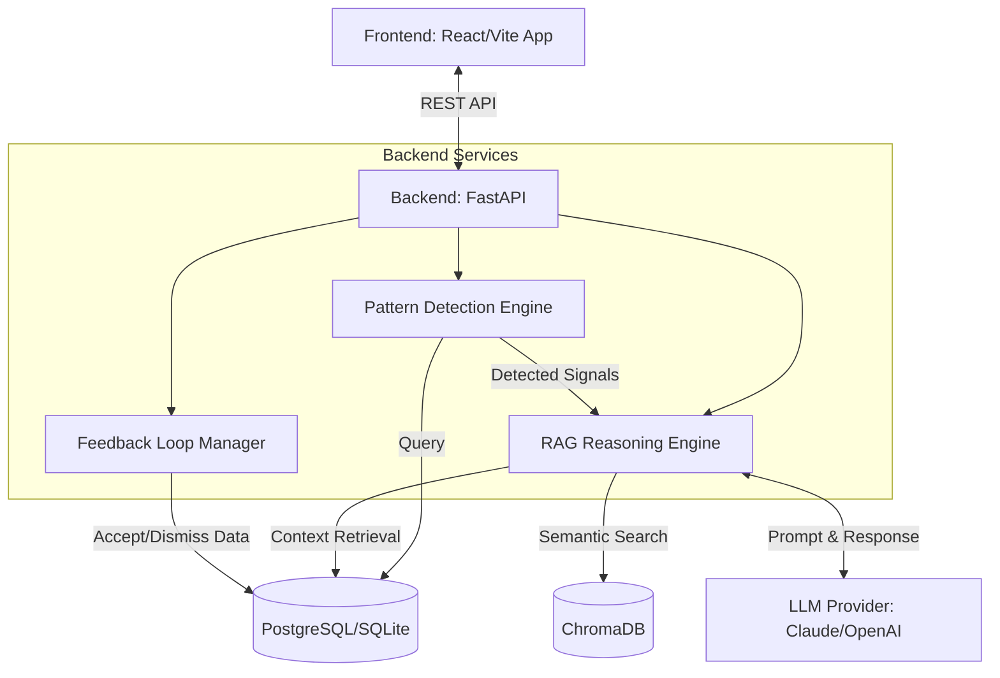
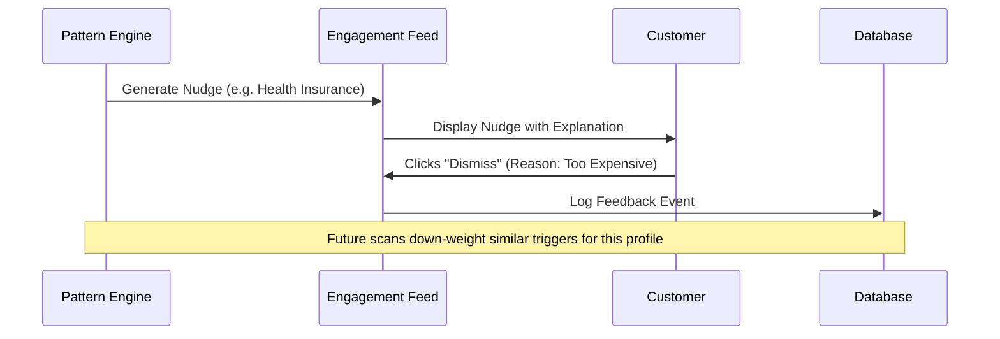

# Nirikshak.AI — Architecture & Data Flow

> **Proactive Intelligence for Life-Stage Banking**
> 
> *This document provides a technical overview of the Nirikshak.AI system for hackathon judges.*

---

## 1. System Overview

Nirikshak.AI is designed to shift banking from a **reactive** model (where customers must seek out products) to a **proactive** one (where the bank intelligently anticipates needs).

It achieves this through a three-stage pipeline:
1. **Sense:** Continuously scan transaction and profile data for life events (e.g., salary hikes, new EMIs).
2. **Reason:** Use a RAG (Retrieval-Augmented Generation) pipeline to fetch product knowledge and use an LLM to evaluate if a product fits the detected context.
3. **Engage:** Deliver a transparent, explainable nudge to the customer.

---

## 2. Component Architecture

### 2.1 Frontend (React + Vite)
- **Role:** Simulates the customer-facing mobile banking app and the internal admin dashboard.
- **Key Features:** Customer 360 view, Proactive Engagement Feed (the nudges), and the Explainability Panel (showing the LLM reasoning trace).

### 2.2 Backend (FastAPI)
- **Role:** Orchestrates the core logic. Provides REST endpoints.
- **Pattern Detection Engine:** A hybrid rule-based engine that scans for specific triggers (e.g., 3 months of rent with no insurance).
- **RAG Reasoning Engine:** The AI core. When a pattern is detected, it pulls the customer's financial profile from the SQL DB, pulls product documentation from the Vector DB, and asks the LLM to generate a personalized recommendation and explanation.

### 2.3 Data Storage
- **Relational DB (PostgreSQL/SQLite):** Stores customers, transactions, triggers, and feedback.
- **Vector DB (ChromaDB):** Stores semantic embeddings of SBI product documentation (e.g., Health Insurance terms, Mutual Fund details).

---

## 3. The Feedback Loop

A critical component of Nirikshak.AI is its ability to learn from customer interactions.

1. **Trigger Generation:** A nudge is created with a confidence score.
2. **Customer Action:** The customer can `Accept` or `Dismiss` the nudge.
3. **Data Logging:** This action is recorded in the `feedbacks` table.
4. **Model Refinement:** Over time, this dataset allows the bank to train a machine learning classifier to replace the rule-based Pattern Detection Engine, significantly improving conversion rates.

---

## 4. Explainability (Responsible AI)

To comply with RBI guidelines and build customer trust, **every** recommendation must be explainable. Nirikshak.AI achieves this by capturing the LLM's reasoning trace.

**Example Trace:**
1. *Signal Detected:* Salary increased by 30%.
2. *Context:* Customer is 28, Moderate risk profile, no existing investments.
3. *Product Matched:* SBI Equity Mutual Fund SIP.
4. *Explanation Generated:* "Congratulations on your salary increase! Start investing the extra income with an SBI Equity SIP..."

This trace is stored in the database alongside the trigger and is auditable by admins.
